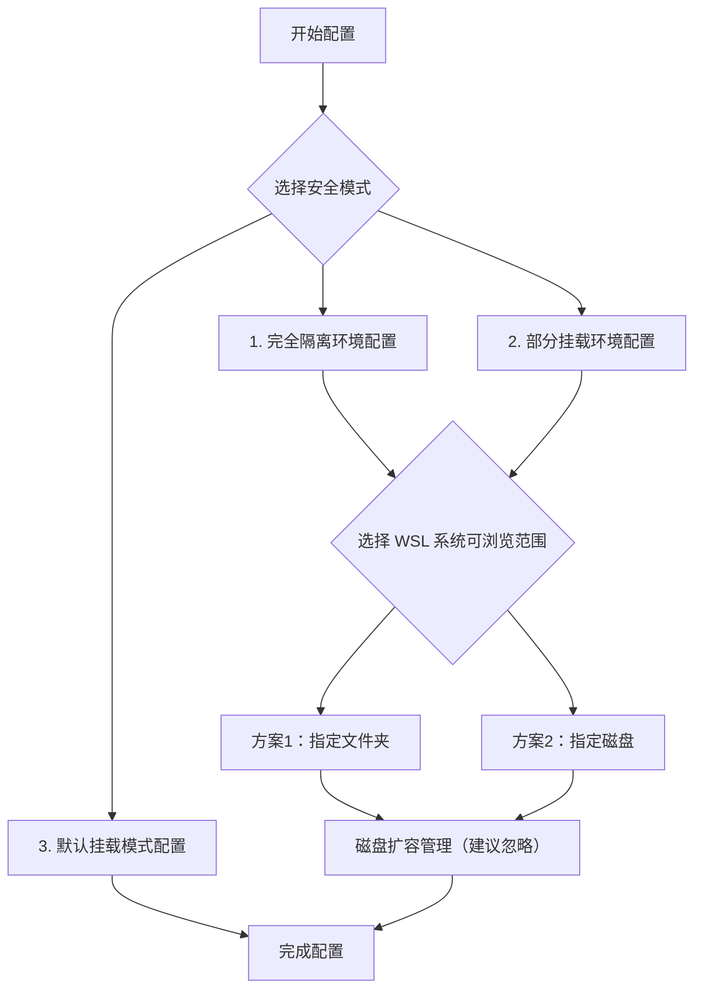

# WSL2 迁移与安全配置完整指南

## 导航流程图



推荐部分挂载加上指定磁盘

**完全隔离模式**： WSL完全独立，最高安全性，只能访问指定的文件夹/磁盘

**部分挂载模式**（推荐）：C盘只读访问，系统文件安全，指定区域完全访问，安全与便利都很好

**默认挂载模式**：所有磁盘可访问

## 开始配置


很多人的C盘空间比较紧张,同时为了安全和方便考虑

遂迁移WSL到其他盘，还能更好管理开发环境。

==**下面给出示例**==

### 迁移步骤

首先完成WSL的迁移工作。

在PowerShell（管理员下）中准备目录结构：

```powershell
# 在目标盘创建WSL主目录
mkdir E:\wsl
mkdir E:\wsl\ubuntu
mkdir E:\wsl_backups
```

导出现有系统（这个过程比较慢，耐心等待）：

```powershell
wsl --export Ubuntu-22.04 E:\wsl_backups\ubuntu.tar
```

删除原系统（确认tar文件存在后再执行）：

```powershell
wsl --unregister Ubuntu-22.04
```

恢复到新位置：

```powershell
wsl --import Ubuntu-22.04 E:\wsl\ubuntu E:\wsl_backups\ubuntu.tar
```

迁移完成后，继续选择安全模式。

## 1. 完全隔离环境配置

**适用场景**：运行AI coding，不信任的程序，需要纯净Linux环境的用户。

这种模式下，WSL完全看不到Windows的任何磁盘，然后可以选择性地只开放指定的文件夹或磁盘让Linux访问。

### 基础隔离设置

进入WSL编辑配置文件：

```bash
wsl -d Ubuntu-22.04
sudo nano /etc/wsl.conf
```

写入以下内容（替换your_username为实际用户名）：

```ini
[automount]
enabled = false

[user]
default = your_username
```

保存后关闭WSL：

```powershell
wsl --shutdown
```

重新启动后，`/mnt/`目录将完全为空，WSL被完全隔离。

选择WSL访问的范围 → [选择可浏览范围](#选择-wsl-系统可浏览范围)

## 2. 部分挂载环境配置

**适用场景**：需要访问Windows部分文件，但希望限制访问范围的用户。

这种模式会将C盘设为只读挂载（能看不能改），然后你可以选择额外开放指定的文件夹或数据盘给Linux完全访问。

### 基础设置

先按照完全隔离的方式关闭自动挂载：

```bash
sudo nano /etc/wsl.conf
[automount]
enabled = false

[user]
default = your_username
```

### C盘只读挂载

编辑fstab文件：

```bash
sudo nano /etc/fstab
```

添加C盘只读挂载：

```
C: /mnt/c drvfs ro,defaults,metadata 0 0
```

创建挂载点并应用：

```bash
sudo mkdir /mnt/c
sudo mount -a
```

现在你可以浏览C盘内容但无法修改，接下来选择额外开放的访问范围 → [选择可浏览范围](#选择-wsl-系统可浏览范围)

## 3. 默认挂载模式配置

**适用场景**：对安全性要求不高，希望保持最大便利性的用户。

这种模式只进行迁移，不做额外的安全配置。所有Windows磁盘都会自动挂载，Linux可以自由访问和修改Windows文件。

### 简单配置

只需要修正默认用户：

```bash
sudo nano /etc/wsl.conf
[user]
default = your_username
```

保存后重启WSL：

```powershell
wsl --shutdown
```

配置完成！建议定期备份重要文件 → [完成配置](#完成配置)

## 选择 WSL 系统可浏览范围

选择完全隔离或部分挂载模式的用户，需要决定额外开放哪些Windows内容给Linux访问。

### 方案1：指定文件夹

适合项目文件组织规范的用户。比如只开放`C:\Users\yourname\Projects`这一个文件夹。

编辑fstab文件（如果是部分挂载模式，在已有C盘只读挂载的基础上添加）：

```bash
sudo nano /etc/fstab
```

添加指定文件夹挂载：

```
# 对于完全隔离模式，只添加这一行
C:\Users\yourname\Projects /home/yourname/projects drvfs defaults,metadata 0 0

# 对于部分挂载模式，在C盘只读挂载下方添加
C:\Users\yourname\Projects /home/yourname/projects drvfs defaults,metadata 0 0
```

创建挂载点并应用：

```bash
sudo mkdir /home/yourname/projects
sudo mount -a
```

**优点**：精确控制，安全性高 **缺点**：不能对同一个磁盘中的多个linux子系统实现文件共享

继续 → [磁盘扩容管理](#磁盘扩容管理)

### 方案2：指定磁盘（推荐）

适合有专门数据盘的用户。比如只开放E盘（项目数据盘）给Linux访问。

编辑fstab文件：

```bash
sudo nano /etc/fstab
```

添加数据盘挂载：

```
# 对于完全隔离模式
E: /mnt/e drvfs defaults,metadata 0 0

# 对于部分挂载模式，在C盘只读挂载下方添加
E: /mnt/e drvfs defaults,metadata 0 0
```

创建挂载点并应用：

```bash
sudo mkdir /mnt/e
sudo mount -a
```

**优点**：管理简单，文件共享 **缺点**：磁盘开放，可能不小心删除其他文件

继续 → [磁盘扩容管理](#磁盘扩容管理)

## 磁盘扩容管理

> **建议忽略**：大多数用户的1TB默认限制已经足够使用

WSL虚拟硬盘默认最大1TB。如果确实需要更大空间才进行扩容。

### 扩容步骤

Windows端扩容：

```powershell
wsl --shutdown
diskpart
select vdisk file="E:\wsl\ubuntu\ext4.vhdx"
expand vdisk maximum=2097152
exit
```

Linux端调整：

```bash
sudo growpart /dev/sdb 1
sudo resize2fs /dev/sdb1
```

用`df -h`确认扩容成功。

继续 → [完成配置](#完成配置)

## 完成配置

